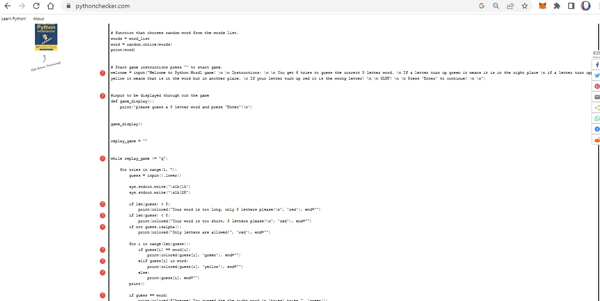
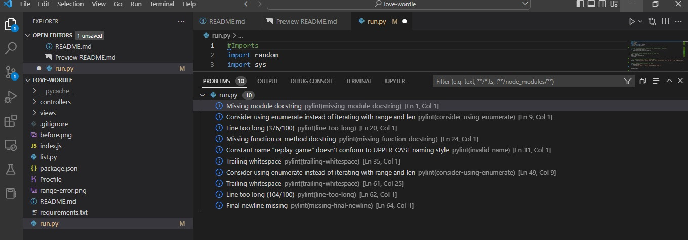
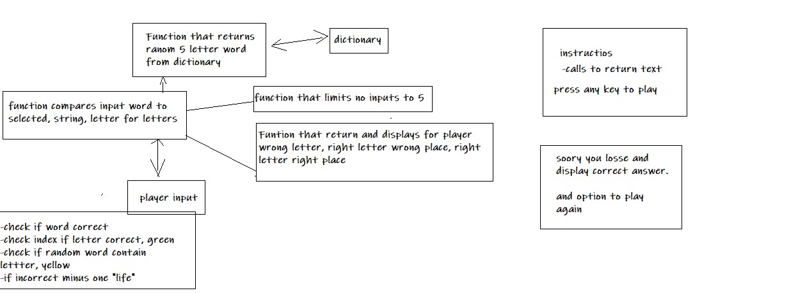

# LOVE_WORDLE GAME

LOVE_WORDLE is a word guessing game Welsh software engineer Josh Wardle that gained alot of traction when it was published in the New York times. 

## Rules

The game plot is easy and very straight forward. You get 6 attempts to guess the secret random 5 letter word. If your guess contains any letters of the secret word but with the wrong placement the letter will be highlighted in yellow. If the letter within the word you guessed has the right placemnet it will be highlighted in green.

## Features

The LOVE_WORLDE game has three diffrent colors using the termcolor module for ANSII Color formatting for output in the terminal. Red, green and Yellow is very intuitive colors that gives clear signals to the user and a nice contrast.

The user is alerted when inputing the wrong number of characters, too short and too long. The user even gets a message if trying to input non aphabetical character.

The LOVE_WORDLE game starts of with a message on the screen displaying the rules in 4 lines. Very easy to read and understand. The user is instructed to press 'enter' to exit the rules screen and begin playing the game.

When the game is over the user is presented with the option to quit the game or play again with the press of a key. (currently bug.)

For the duration of the game the user is promted to input a word with a message of 'please guess a 5 letter word and press "Enter"'

## Bugs and Testing 

### Testing
In Python checker it got 10 errors. Most of them where to long lines of code and white space around operators, even though it was not operators. 

In console it warned for 10 problems:

### Known bugs
- Exits the game when the guess input exceeds 5 letters
- Does not restart the game with the game start message 
- Highlights a letter in yellow if yout guess contains more than two and the word only contians one instance of that letter.
- not able to press "Q" to brake the loop.

## Future features

To fix the already mentioned bugs would enhace the experience. I had them working at one point but when formatted the code it started to throw errors.

## Credits

credits to my mentor Mitko that helped me come up with the idea of a word guessing game and provided me with resources for how to go about wireframing the functions:

a big shout out to: 
https://www.freecodecamp.org/news/how-to-build-a-wordle-clone-using-python-and-rich/

I got alot of help from especially with the function for comparing and printing out the guess letters with the words letter and sys module in phyton to get the cursor on the next line and getting the while loop to work:
https://replit.com/@JacobLower3/wordle-tutorial#main.py

the colors idea from:
https://ozzmaker.com/add-colour-to-text-in-python/
-----
Happy coding!